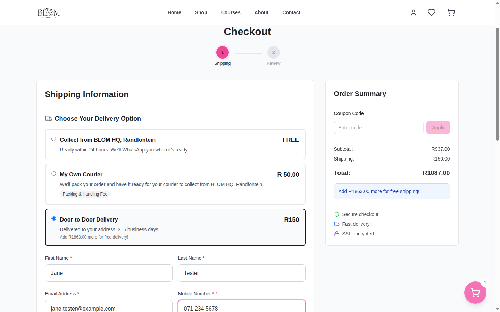

# BLOM Cosmetics — Storefront

Production e-commerce and course-booking platform for a South African professional nail-products brand. Customers buy products and bundles, book in-person and online training courses, and pay through PayFast or Payflex. Orders, invoices, shipping and course enrolment run on serverless functions backed by Supabase.

> Live production system. This repository is the customer-facing storefront; the internal back-office lives in a separate repository (`blom-admin`).

---

## Overview

BLOM sells professional nail products (acrylic systems, gels, tools, kits) to nail technicians and runs hands-on and online nail-technician training courses.

The storefront gives the business a single system for:

- a searchable product and bundle catalogue with variants and stock status
- checkout with two payment gateways, delivery options and coupon handling
- course sales with deposit or pay-in-full options and automatic enrolment into the online academy
- customer accounts, order history, invoices and order tracking

## The problem

- Payments arrive through two gateways (card/EFT and buy-now-pay-later) plus course deposits, and a payment is easily lost when a shopper approves it but never returns to the site.
- Delivery fees, promotions and coupon discounts must agree exactly between what the shop advertises, what the customer is charged, and what the invoice shows.
- Course buyers must be enrolled in a separate online academy and their instructor notified, without staff doing it by hand.

## The solution

- **Server-authoritative checkout.** Order totals are recomputed in a Netlify Function from database prices; the browser's cart is never trusted for product prices or coupon totals.
- **Two payment gateways with reconciliation.** PayFast ITN callbacks are signature-checked and validated with PayFast before an order is marked paid. Payflex payments are confirmed on return, by webhook, and by an hourly reconciliation job that catches shoppers who never return to the site.
- **Single source of truth for pricing rules.** Delivery pricing and promotions live in shared TypeScript modules imported by both the React app and the serverless functions, so the quoted, charged and invoiced amounts cannot drift. These modules are unit-tested.
- **Automated fulfilment.** Paid orders trigger PDF invoice generation, stored in Supabase Storage, and n8n workflows for customer and staff notifications. Paid course orders enrol the buyer in the academy and notify the instructor.

## Key features

**Shopping**
- Product catalogue with categories, variants, bundles, search and filtering
- Product detail pages with galleries, reviews and related products
- Cart, wishlist, and promotional offers (e.g. buy-two, seasonal promotions)
- Coupon redemption validated server-side

**Checkout and payments**
- PayFast card/EFT payments with ITN (Instant Transaction Notification) handling
- Payflex instalment payments with redirect, webhook and scheduled reconciliation
- Delivery options: door-to-door courier, parcel-locker pickup points, studio collection, and same-day Uber Direct quotes
- South African postal-code lookup

**Courses**
- Course catalogue with multiple instructors, locations and available dates
- Deposit or pay-in-full purchase
- Automatic enrolment into the separate online academy, with retry for failed invites

**Customer accounts**
- Supabase Auth sign-up, login and password reset
- Order history, order detail and public order tracking
- Saved addresses and personal coupons
- Invoice viewer backed by generated PDFs

**Content**
- Stockist locator map
- Product and site review submission with moderation workflow

## Tech stack

| Area | Technology |
|---|---|
| Frontend | React 18, TypeScript, Vite 5, React Router 7, Tailwind CSS, Framer Motion |
| Maps | Leaflet / React Leaflet, Google Maps JavaScript API |
| Backend | Netlify Functions (TypeScript, bundled with esbuild), including scheduled functions |
| Database and auth | Supabase (PostgreSQL, Auth, Storage, row-level security, SQL functions) |
| Payments | PayFast, Payflex |
| Shipping | Shiplogic (courier and parcel lockers), Uber Direct |
| Documents | pdf-lib (server-side invoice generation) |
| Media | Cloudinary |
| Automation | n8n webhooks (notifications, reviews, sign-ups) |
| Quality | ESLint (typescript-eslint), `tsc --noEmit`, Node test runner via `tsx` |
| Hosting | Netlify |

## Architecture

```
Browser (React SPA)
  │  reads public catalogue data with the Supabase anon key (RLS-protected)
  │
  ├──► Netlify Functions  (netlify/functions/*.ts)
  │       create-order ─────► prices the cart from the database, applies coupons/shipping
  │       payfast-redirect ─► signs the PayFast payment request
  │       payfast-itn ◄────── PayFast server callback: verify signature + validate, mark paid
  │       payflex-* ◄───────► Payflex checkout, webhook, confirm, hourly reconcile
  │       invoice-generate-pdf ─► pdf-lib invoice → Supabase Storage
  │       enroll-course ────► academy enrolment + instructor notification
  │       shipping-*, uber-quote, pickup-points ─► carrier integrations
  │
  ├──► Supabase  (PostgreSQL + Auth + Storage)
  │       supabase/migrations/  — schema, RLS policies, SQL functions (RPCs)
  │
  └──► n8n  — email / WhatsApp notifications and review workflows
```

```
src/
├── components/     UI building blocks (layout, product, cart, checkout, reviews, ui)
├── pages/          route-level pages (shop, product, courses, checkout, account, …)
├── lib/            shared domain logic (cart, pricing, shipping, promotions, auth, Supabase client)
│   └── *.test.ts   unit tests for pricing and promotion rules
├── hooks/  types/  utils/  config/  data/
netlify/functions/  serverless API; _lib/ holds shared server helpers
supabase/migrations/ database schema and policies
scripts/            one-off data and maintenance scripts (seeding, exports)
docs/               project documentation; docs/archive/ holds historical working notes
```

Secrets live only in Netlify environment variables. Anything prefixed `VITE_` is compiled into the browser bundle and is treated as public.

## Engineering highlights

- **Payment integrity.** The PayFast ITN handler rebuilds the signature from the posted fields, compares it with and without the passphrase, confirms the notification with PayFast's validation endpoint, and checks the paid amount before updating the order.
- **Resilient BNPL reconciliation.** Payflex confirmation has three independent paths (return URL, webhook, scheduled sweep) sharing one reconcile engine, so an approved payment is recorded even if the shopper closes the tab.
- **Shared domain logic across client and server.** `src/lib/shipping.ts` and the promotion modules are imported by both the SPA and the functions, and are covered by unit tests (`npm test`).
- **Server-side PDF invoices** rendered with pdf-lib and stored in Supabase Storage, with an hourly backfill job for any order that missed generation.
- **Cross-project integration.** Course purchases on the store enrol students in a separate Supabase project (the online academy), with a retry job for failed invitations.
- **Route-level code splitting.** Pages are lazy-loaded, keeping the main bundle to roughly 107 kB gzipped.

## Screenshots

### Home


### Product detail


### Checkout



### Mobile storefront


Shop and course-page captures are also in `docs/screenshots/`. All customer fields in
the checkout screenshot are placeholder test data, never a real order.

## Running locally

**Requirements:** Node.js 22 (see `.nvmrc`), npm, and the [Netlify CLI](https://docs.netlify.com/cli/get-started/) if you want to run the serverless functions.

```bash
npm install
cp .env.example .env     # then fill in values for the services you need
npm run dev              # Vite dev server — frontend only, http://localhost:5173
```

To run the frontend together with the Netlify Functions:

```bash
netlify dev              # http://localhost:8888
```

The frontend renders catalogue pages with only `VITE_SUPABASE_URL` and `VITE_SUPABASE_ANON_KEY` set. Checkout, payments, shipping and invoices need the corresponding server-side variables. Use PayFast and Payflex sandbox credentials for local work (`PAYFAST_ENV=sandbox`).

## Testing and quality

| Command | Purpose |
|---|---|
| `npm run build` | Production build (Vite) |
| `npm run typecheck` | TypeScript type check (`tsc --noEmit`) |
| `npm run lint` | ESLint |
| `npm test` | Unit tests for shipping, promotions and offers (Node test runner) |
| `npm run check` | Typecheck, lint and tests in sequence |

The unit tests cover the pricing rules that must agree between the storefront, the order function and the invoice: free-delivery thresholds, promotional discounts and multi-buy offers.

Known quality debt: the lint step still reports explicit `any` usage, concentrated in Supabase row handling and function payloads, and two type errors remain in `src/lib/auth.ts` and the product template demo page.

## Deployment

The site deploys to Netlify (`netlify.toml`): `npm run build` publishes `dist/`, and `netlify/functions/` is bundled with esbuild. Scheduled functions (invoice backfill, Payflex reconciliation) are declared in code with Netlify's `schedule` helper. Database changes are applied as SQL migrations in `supabase/migrations/`.

## What I built

I developed and maintain this platform for the client as a working production system. The work in this repository includes:

- the React/TypeScript storefront, including catalogue, product, course, checkout and account flows
- the serverless API: order creation with server-side pricing, PayFast and Payflex integrations, reconciliation jobs, shipping integrations and invoice generation
- the Supabase schema, row-level security policies and SQL functions
- the integration between the store and the separate online academy for course enrolment
- n8n automation for notifications and review moderation
- unit tests for the shared pricing logic

AI coding assistants were used as development tools during parts of this project. Design decisions, integration work, debugging against live services, and responsibility for the production system are mine.
